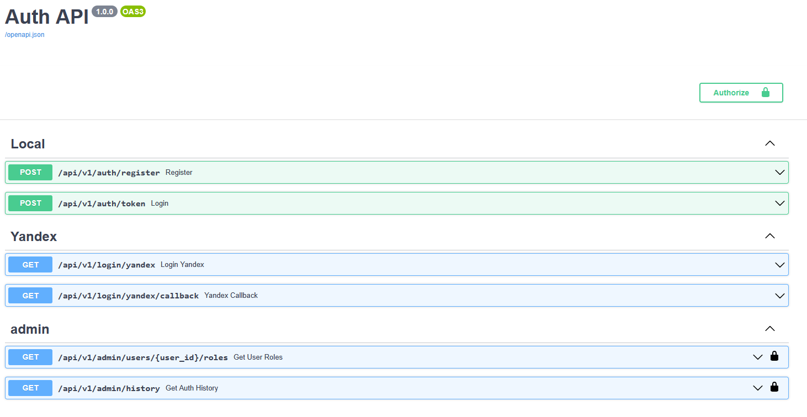
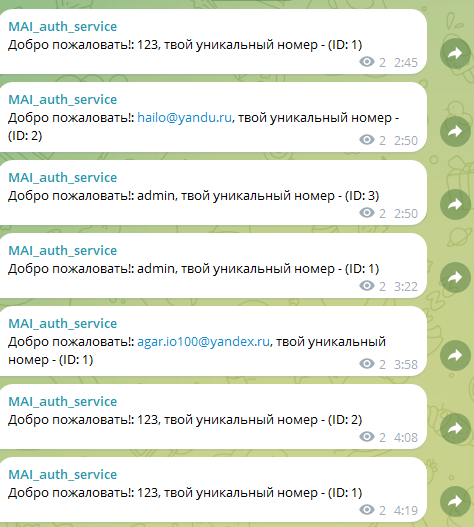

# fastapi_auth_service

## 🌟 Особенности
- **JWT-авторизация** с ролевой моделью (user/admin)
- **OAuth2-провайдеры**: Yandex (Без VK)
- **История входов** с указанием метода аутентификации
- **Telegram-уведомления** о новых регистрациях (через Kafka)



Всего 6 маршрутов
1. Метод POST путь: /api/v1/auth/register - Регистрирует нового пользователя
2. Метод POST путь: /api/v1/auth/token - Авторизация
3. Метод GET путь: /api/v1/login/yandex - Авторизация через Яндекс
4. Метод GET путь: /api/v1/login/yandex/callback - Перенапрявляет пользователя на этот endpoint, когда он войдет через яндекс с параметром code, по этому параметру достается access_token для пользователя
5. Метод GET путь: /api/v1/admin/users/{user_id}/roles - Просмотр админом всех пользователей и их ролей
6. Метод GET путь: /api/v1/admin/history - Просмотр админом истории всех авторизаций

После того как пользователь авторизовался, в телеграмм канал публичный приходит оповещение об авторизации, которое доставляется через kafka.



## 🚀 Быстрый старт

В файле .env записать информацию
В терминале папки проекта:
```sh
docker-compose up --build
```
Подключение к базе данных:

```sh
docker exec -it fastapi_auth_service-db-1 bash
```

Дальше в консоли докера:

```sh
psql -U your_user_name -d your_db_name
```

